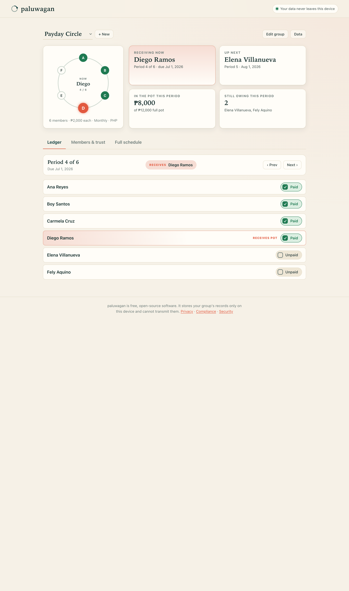

# paluwagan

**A trust ledger for informal savings groups — offline, no login, no backend.**

A *paluwagan* is a savings circle: a fixed group of people who each contribute the
same amount every period, and each period one member takes the whole pot. The pot
rotates until everyone has received it once. The same idea is known around the
world as a **ROSCA** (rotating savings and credit association), a **chit fund**,
**tanda**, **cundina**, **susu**, **hui**, **ajo**, **committee**, or **stokvel**.

For generations these groups have run on a paper notebook: a grid of names and
periods, with ticks for who has paid and a note of whose turn it is to collect.
The notebook works — until it is lost, argued over, or the columns stop adding up.

**paluwagan** is that notebook, made trustworthy. It runs entirely in your browser,
stores everything on your own device, and cannot send your data anywhere. No
account, no server, no tracking.

## Features

- **Create a group** — name, contribution amount, currency (₱ PHP by default; also
  $, €, ₹), frequency (weekly / every 2 weeks / monthly), and a start date. The
  number of periods always equals the number of members.
- **Members and rotation** — add or remove members and set the exact payout order:
  who receives the pot in which period.
- **The ledger** — for each period, toggle every member's contribution paid or
  unpaid, and see who is receiving the pot that period.
- **Dashboard** — the current period, who is collecting now and who is next, how
  much is in the pot this period, and who still owes.
- **Trust scores** — each member gets an on-time payment rate as a percentage. This
  is the "trust" in trust ledger: a plain, shared record of who has kept up.
- **Balances** — per member, total contributed, total received, and net position
  across the whole cycle. When a cycle completes with everyone paid, every net
  settles to zero.
- **Full schedule** — the complete grid of periods × members, with the payout
  recipient highlighted and every paid/unpaid mark visible, scrollable on a phone.
- **Your data, your control** — **Export** to a JSON file, **Import** it back on
  any device, or **Delete everything** with one confirmed click.

## How your privacy is protected

paluwagan is built so it *cannot* leak your group's data, not merely promises not
to.

- **It never talks to a network.** The page ships with a Content-Security-Policy of
  `connect-src 'none'`, which the browser enforces: fetch, XHR, WebSockets, and
  beacons are all blocked. There is no analytics, no telemetry, no "phone home."
  Even if a future bug tried to send data out, the browser would refuse.
- **Everything stays in local storage on your device.** Your groups live under a
  single key in this browser's `localStorage`. Clearing it (or using the Delete
  button) removes every trace.
- **You move your own data.** Export and Import are the only ways data leaves or
  enters — a file you control, on a transfer you initiate.

Because a paluwagan involves other people's names, whoever records the group should
have those members' agreement first. See [PRIVACY.md](PRIVACY.md) and
[COMPLIANCE.md](COMPLIANCE.md) for the full, honest detail.

## Quickstart

paluwagan is a static site with no build step and no dependencies.

**Open it locally** — because it uses ES modules, open it through a tiny local
server rather than `file://`:

```bash
# from the project directory, any one of these:
python3 -m http.server 4173
# or: npx serve .
```

Then visit <http://localhost:4173/>.

**Hosted:** <https://sreenivas-sadhu-prabhakara.github.io/paluwagan/>

*(The included GitHub Pages workflow deploys the repository root as-is on every push
to `main`.)*

Once loaded, the app works fully offline and can be installed as an app on phones
and desktops (it registers a service worker to cache the shell).



*(Add your own screenshot at `docs/screenshot.png`; see [docs/](docs/).)*

## Running the tests

The domain logic (schedule and rotation building, balances, trust scores, and
storage) lives in pure, DOM-free ES modules under `src/`, with a test suite that
uses only Node's built-in test runner — no packages to install.

```bash
npm test          # runs: node --test "test/**/*.test.js"
```

Requires **Node 18 or newer** (for the built-in `node:test` runner).

## How it is built

- **No framework, no build, no runtime dependencies, no CDN, no web fonts.** Just
  HTML, CSS, and vanilla ES modules.
- Pure logic is split into framework-free modules: `src/model.js` (group,
  schedule, and rotation), `src/settlement.js` (balances and trust), and
  `src/store.js` (local storage, export/import). All date-dependent functions take
  the date as a parameter, so the logic is deterministic and testable — the UI
  passes the real date, the tests pass fixed ones.
- All DOM code lives in `src/app.js`. Styling is in `src/style.css`.
- An optional service worker (`sw.js`) caches the app shell for offline use.

## Contributing

Contributions are welcome. Please read [CONTRIBUTING.md](CONTRIBUTING.md) and the
[Code of Conduct](CODE_OF_CONDUCT.md). In short: keep it dependency-free, run
`npm test`, and open a pull request.

## License

[MIT](LICENSE) © 2026 Sreenivas Sadhu
